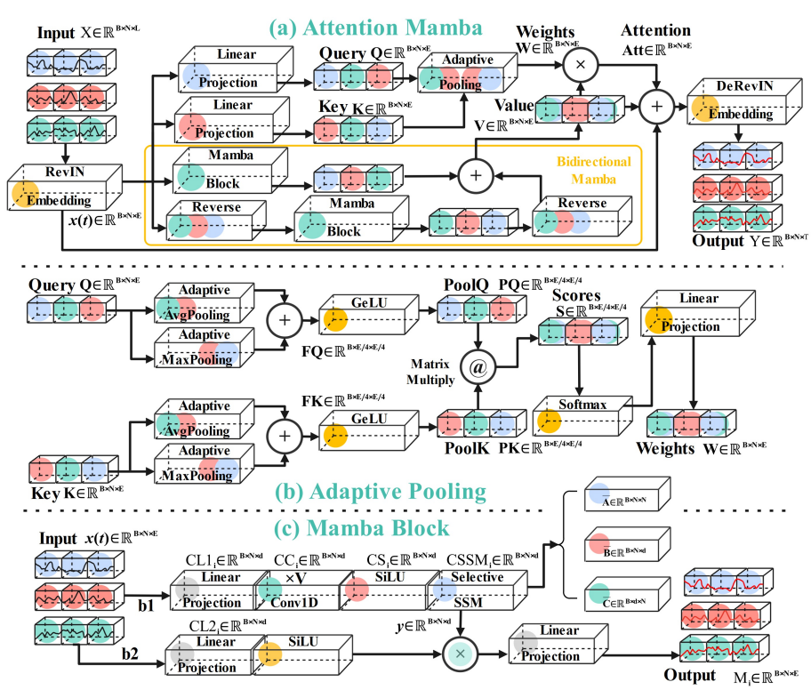

# 📢 Attention Mamba: Time Series Modeling with Adaptive Pooling Acceleration and Receptive Field Enhancements


🙋 Sijie Xiong, Shuqing Liu, Cheng Tang, Fumiya Okubo, Haoling Xiong, Atsushi Shimada.

🏫 Kyushu University, East China University of Science and Technology

# 🎉 Latest News

- **30-June-2025** Accepted by IEEE SMC Conference 2025.

# 🌟 Attention Mamba



# 🏆 Contributions

- We creatively design an Adaptive Pooling block to enhance nonlinear dependency extractions in attentions and widen receptive fields by providing global features through adaptive pooling techniques, while also effectively alleviating the computational complexity of attention mechanisms.
- We propose a novel Mamba-based model, Attention Mamba, by integrating the previous Adaptive Pooling block with a bidirectional Mamba block. The two blocks boost refined features and achieve an equilibrium between computational complexity and accuracy, improving the comprehensive performance of Attention Mamba.
- Extensive experiments on benchmark models across diverse datasets are implemented, demonstrating the excellent performance of Attention Mamba among leading counterparts. We also discuss the advantages and drawbacks of Attention Mamba in the end.

# ☀️ Follow Me and Find Yourselves

## 🔧 Environment Installation

`pip install -r requirements.txt`

⚠️ Although our work is built upon  with , we sincerely recommend users to work on an Ubuntu platform. Otherwise, it will take a lot of time to resolve the compatibility across 📦**mamba-ssm** and 🖥️ **system**.

## 📊 Datasets

- ETT, PEMS datasets are provided. Users can get them after ▶️`git clone` our codehub.
- As for Electricity, Solar-Energy, Traffic, Weather datasets, please ▶️`unzip (extract here) Solar.zip/traffic.zip/weather.zip` at users' comfortable ways.

🙏 Our future work will contain more datasets, they probably will be sync updated here.

## 🚀 Train and Evaluate Attention Mamba

We have written special .sh files to manage the large number of experiments and configurations.

For example, users can follow the command format ▶️`bash ./.../Attention_Mamba.sh`to train and evaluate Attention Mamba and their own models:

```bash
# ECL
bash ./scripts/multivariate_forecasting/ECL/Attention_Mamba.sh
# Weather
bash ./scripts/multivariate_forecasting/Weather/Attention_Mamba.sh
# Solar-Energy
bash ./scripts/multivariate_forecasting/SolarEnergy/Attention_Mamba.sh
# PEMS
bash ./scripts/multivariate_forecasting/PEMS/Attention_Mamba_03.sh
bash ./scripts/multivariate_forecasting/PEMS/Attention_Mamba_04.sh
bash ./scripts/multivariate_forecasting/PEMS/Attention_Mamba_07.sh
bash ./scripts/multivariate_forecasting/PEMS/Attention_Mamba_08.sh
```

For more configurations, please look into 📄`./scripts/multivariate_forecasting/**Dataset**/**Attention_Mamba-{}-{}.sh**`.
Attention Mamba is implemented via  ▶️`README_run.md`

⚠**️Remark**: we give configuration samples rather than the fine-tuned configurations.

🌟The easiest way for users who want to make their own models, if you like, is to follow the same rules.

## ✅ Results

In Attention Mamba, all results will be stored in 📃 **result_long_term_forecast.txt** and the training processes will be stored in 📁 **train_records** directory.

🌟 Please develop analysis charts based on the results, and further customize or extend them according to users' specific needs. Herein, we reserve our own ones.

## 🙏Acknowledgement

We are sincerely grateful for the following awesome projects when implementing our Attention Mamba and they also inspire us to have Attention Mamba public to counterparts.

- 🙇 [Mamba](https://github.com/state-spaces/mamba)
- 🙇 [S-Mamba](https://github.com/wzhwzhwzh0921/S-D-Mamba)
- 🙇 [iTransformer](https://github.com/thuml/iTransformer)
- 🙇 [RLinear](https://github.com/plumprc/RTSF/tree/main)
- 🙇 [PatchTST](https://github.com/yuqinie98/PatchTST)
- 🙇 [Crossformer](https://github.com/Thinklab-SJTU/Crossformer)
- 🙇 [TiDE](https://github.com/google-research/google-research/tree/master/tide)
- 🙇 [TimeNet](https://github.com/paudan/TimeNet)
- 🙇 [DLinear](https://github.com/cure-lab/LTSF-Linear)
- 🙇 [FEDformer](https://github.com/DAMO-DI-ML/ICML2022-FEDformer)
- 🙇 [Autoformer](https://github.com/thuml/Autoformer)

## 📖 Citation

If you are fond of our work and consider our work helpful to your research, please cite us:

```
@inproceedings{xiong2025attentionmamba,
  title={{Attention Mamba: Time Series Modeling with Adaptive Pooling Acceleration and Receptive Field Enhancements}},
  author={Xiong, Sijie and Liu, Shuqing and Tang, Cheng and Okubo, Fumiya and Xiong, Haoling and Shimada, Atsushi},
  booktitle = {IEEE International Conference on Systems, Man, and Cybernetics (SMC)}
  volume = {},
  number = {},
  pages = {},
  month = {Oct.},
  year={2025}
  doi={}
}
```

## 🤝 Academic Collaboration

We are warmly welcome potential collaborations with researchers around the world. This is not limited to new ideas, improvements, bug fixing etc.

We are open to interdisciplinary dialogue and collaboration across diverse academic fields, such as control, education, finance, biology, medicine design, etc.

If you have any intended passion to collaborate with us, please feel free to contact us by emails.

📮 [sijiexiongkyushu@gmail.com](sijiexiongkyushu@gmail.com)

📮 [limu-staff@limu.ait.kyushu-u.ac.jp](limu-staff@limu.ait.kyushu-u.ac.jp)
